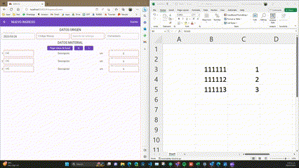
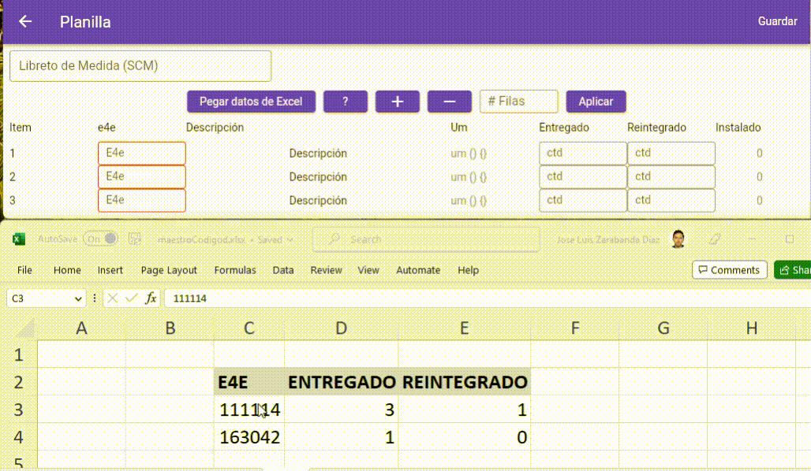

# SAM+ | Sistema de Administración de Materiales

<div align="center">


**Sistema empresarial multiplataforma para gestión integral de inventarios, logística y operaciones de almacén**

[Características](#-características) • [Tecnologías](#-stack-tecnológico) • [Arquitectura](#-arquitectura) • [Instalación](#-instalación) • [Contacto](#-contacto)

</div>

---

## 📋 Descripción

**SAM+** es una aplicación empresarial completa desarrollada en Flutter que permite la gestión integral de operaciones logísticas y de inventario. El sistema fue diseñado para optimizar los procesos de control de materiales, planificación de recursos y trazabilidad de operaciones en entornos industriales.

<div align="center">
  
</div>

### 🎯 Problema que Resuelve

- **Control de inventario en tiempo real** con sincronización multi-plataforma
- **Trazabilidad completa** de movimientos de materiales (ingresos, traslados, consumos)
- **Integración con sistemas SAP** (MB51, MB52, MM60) para conciliación de datos
- **Gestión de logística inversa** (chatarra, devoluciones, carretes, transformadores)
- **Planificación de recursos** con fichas técnicas y gestión de pedidos

---

## ✨ Características

### 📦 Gestión de Inventario
- **Nuevo Ingreso/Traslado**: Registro de movimientos de materiales
- **Informe de Saldos**: Visualización consolidada de existencias
- **Inventario en tiempo real**: Sincronización con múltiples fuentes de datos

### 🔄 Control de Movimientos
- **Planillas digitales**: Creación y gestión de planillas de movimiento
- **Registros históricos**: Trazabilidad completa de operaciones
- **Conciliaciones**: Herramientas de conciliación contable
- **Balances**: Generación automática de balances de materiales

<div align="center">
  
</div>

### 📊 Integración SAP
- **MB51**: Visualización de documentos de material
- **MB52**: Stock por almacén
- **MM60**: Análisis de movimientos
- **LCL/DFLCL**: Gestión de localizaciones

### 🔧 Planificación
- **Fichas técnicas**: Gestión detallada de especificaciones
- **Pedidos**: Control de solicitudes de material
- **Fechas FEM**: Planificación de entregas
- **Aportación y Sustitutos**: Gestión de alternativas de materiales

### ♻️ Logística Inversa
- **Chatarra**: Control de materiales para disposición
- **Carretes y Transformadores**: Gestión de activos retornables
- **Trazabilidad Barcode**: Seguimiento por código de barras
- **Homologación**: Control de materiales homologados

---

## 🛠 Stack Tecnológico

### Frontend
| Tecnología | Uso |
|------------|-----|
| **Flutter 3.7+** | Framework UI multiplataforma |
| **Dart** | Lenguaje de programación |
| **flutter_bloc** | Gestión de estado (BLoC Pattern) |
| **Material Design 3** | Sistema de diseño |

### Backend & Servicios
| Tecnología | Uso |
|------------|-----|
| **Firebase Auth** | Autenticación de usuarios |
| **Cloud Firestore** | Base de datos en tiempo real |
| **Supabase** | Backend as a Service (PostgreSQL) |
| **Google Apps Script** | APIs personalizadas |

### Herramientas
| Tecnología | Uso |
|------------|-----|
| **fl_chart** | Visualización de datos |
| **pdf** | Generación de reportes |
| **file_picker** | Gestión de archivos |
| **csv** | Procesamiento de datos |

---

## 🏗 Arquitectura

El proyecto implementa una arquitectura limpia basada en el patrón **BLoC** (Business Logic Component) con separación por features:

```
lib/
├── bloc/                    # Estado global de la aplicación
│   ├── main_bloc.dart       # BLoC principal
│   ├── main_state.dart      # Estados
│   └── main_event.dart      # Eventos
├── config.dart              # Configuración centralizada
├── resources/               # Recursos compartidos
│   └── constant/
│       └── apis.dart        # Endpoints de APIs
├── [feature]/               # Módulos por funcionalidad
│   ├── controller/          # Lógica de negocio
│   ├── model/               # Modelos de datos
│   └── view/                # Widgets y pantallas
├── login/                   # Autenticación
├── home/                    # Dashboard principal
├── inventario/              # Gestión de inventario
├── planilla/                # Planillas de movimiento
├── ficha/                   # Fichas técnicas
├── chatarra/                # Logística inversa
└── ...                      # Más módulos
```

### Patrones de Diseño
- **BLoC Pattern**: Separación de UI y lógica de negocio
- **Repository Pattern**: Abstracción de fuentes de datos
- **Feature-First Structure**: Organización por módulos funcionales
- **Dependency Injection**: Configuración centralizada

---

## 🚀 Instalación

### Prerrequisitos
- Flutter SDK 3.7 o superior
- Dart SDK 3.0 o superior
- Cuenta de Firebase
- Cuenta de Supabase (opcional)

### Pasos

1. **Clonar el repositorio**
```bash
git clone https://github.com/tu-usuario/sam-inventory-management.git
cd sam-inventory-management
```

2. **Instalar dependencias**
```bash
flutter pub get
```

3. **Configurar variables de entorno**
```bash
# Copiar archivo de ejemplo
cp .env.example .env

# Editar con tus credenciales
# Ver .env.example para las variables requeridas
```

4. **Configurar Firebase**
```bash
# Opción 1: Usar FlutterFire CLI
dart pub global activate flutterfire_cli
flutterfire configure

# Opción 2: Copiar archivos de ejemplo
cp lib/firebase_options.example.dart lib/firebase_options.dart
cp android/app/google-services.example.json android/app/google-services.json
cp ios/Runner/GoogleService-Info.example.plist ios/Runner/GoogleService-Info.plist
# Luego editar con tus credenciales
```

5. **Ejecutar la aplicación**
```bash
# Web
flutter run -d chrome

# Android
flutter run -d android

# iOS
flutter run -d ios
```

---

## 📁 Variables de Entorno

El proyecto usa `flutter_dotenv` para gestionar variables de entorno. Ver `.env.example`:

```env
# Supabase
SUPABASE_URL=https://your-project.supabase.co
SUPABASE_ANON_KEY=your-anon-key

# Google Apps Script APIs
API_SAM=https://script.google.com/macros/s/YOUR_SCRIPT_ID/exec
API_FEM=https://script.google.com/macros/s/YOUR_SCRIPT_ID/exec
```

---

## 📸 Capturas

<div align="center">
<table>
  <tr>
    <td align="center"></td>
    <td align="center"></td>
    <td align="center"></td>
  </tr>
</table>
</div>

---

## 🔒 Seguridad

- Autenticación con Firebase Auth
- Verificación de email obligatoria
- Gestión de permisos por roles
- Variables de entorno para credenciales sensibles
- Conexiones HTTPS para todas las APIs

---

## 📈 Métricas del Proyecto

- **+40 módulos** funcionales
- **+200 archivos Dart**
- Soporte multiplataforma (Web, Android, iOS, Windows)
- Integración con 3+ sistemas externos
- Gestión de estado reactiva con BLoC

---

## 🤝 Contribución

Las contribuciones son bienvenidas. Por favor:

1. Fork el proyecto
2. Crea una rama para tu feature (`git checkout -b feature/AmazingFeature`)
3. Commit tus cambios (`git commit -m 'Add some AmazingFeature'`)
4. Push a la rama (`git push origin feature/AmazingFeature`)
5. Abre un Pull Request

---

## 📄 Licencia

Este proyecto está bajo la Licencia MIT. Ver el archivo `LICENSE` para más detalles.

---

## 📞 Contacto

**Desarrollador**: [Tu Nombre]

[](https://linkedin.com/in/tu-perfil)
[](https://github.com/tu-usuario)
[](mailto:tu@email.com)

---

<div align="center">

**⭐ Si este proyecto te resulta útil, considera darle una estrella ⭐**

Desarrollado con ❤️ usando Flutter

</div>
